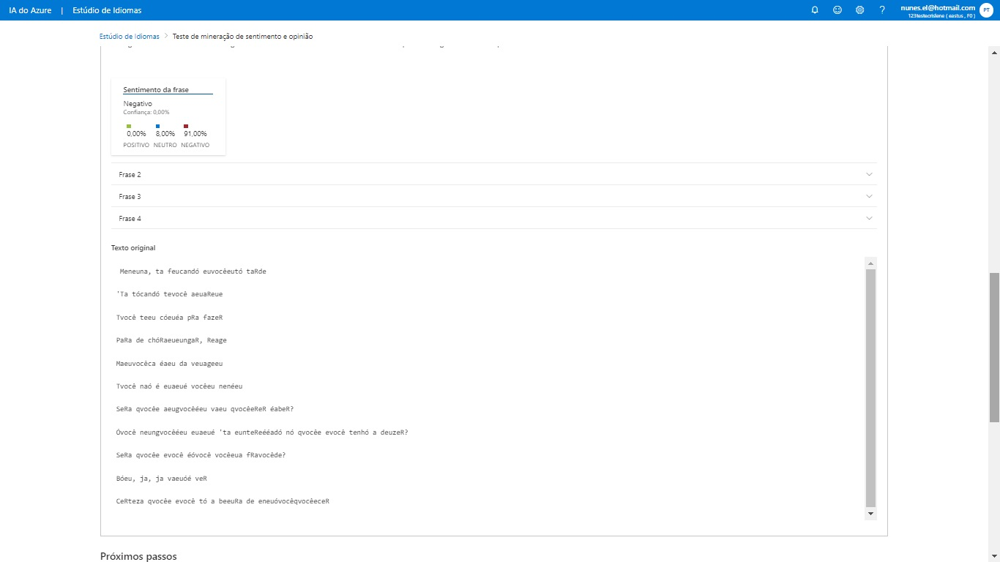
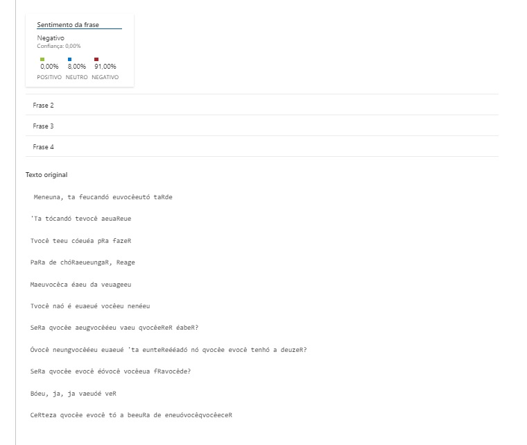

# Análise de Sentimentos com Language Studio no Azure AI

Neste projeto, exploramos a aplicação de um modelo avançado de análise de sentimentos por meio do Azure Language Studio. Este serviço representa uma poderosa ferramenta de inteligência artificial que capacita a análise de textos em uma ampla gama de idiomas, permitindo identificar nuances emocionais e determinar com precisão o tom subjacente do texto, seja ele positivo, negativo ou neutro. Ao empregar essa tecnologia, podemos compreender melhor as nuances do conteúdo textual e extrair insights valiosos para uma variedade de aplicações, desde a avaliação de opiniões de clientes até a análise de tendências de mercado.

## Análise de Sentimentos e Opiniões

O recurso Análise de Sentimento da API Text Analytics fornece rótulos de sentimento (como "negativo", "neutro" e "positivo") e pontuações de confiança no nível da frase e do documento. Você também pode enviar solicitações de Opinion Mining usando o endpoint Sentiment Analysis, que fornece informações granulares sobre as opiniões relacionadas às palavras (como atributos de produtos ou serviços) no texto.

## Passo a Passo

- Acesse o [Azure Language Studio](https://language.cognitive.azure.com/tryout/sentiment).
- Escolha um idioma para o texto que será analisado.
- Insira o texto ou faça o upload de um arquivo para ser analisado.
- O Azure retornará um relatório completo da análise do texto.

## Texto Utilizado

Utilizamos um trecho da música "Principalmente me sinto arrasada" de Luísa Sonza:

*"Menina, tá ficando muito tarde
Tá tocando teu alarme
Tu tem coisa pra fazer
Para de choramingar, reage
Maluca sai da viagem
Tu não é mais um neném
… Será que alguém vai querer saber?
Ou ninguém mais tá interessado no que eu tenho a dizer?
Será que eu sou uma fraude?
Bom, já, já vamos ver
Certeza que eu to a beira de enlouquecer"*

